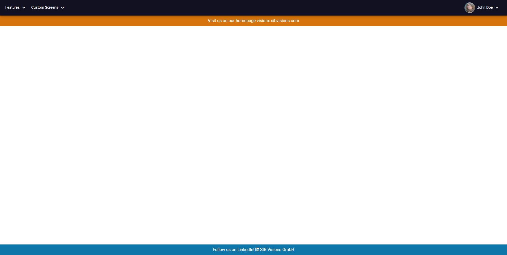

# Custom-Application-Frames

## Overview

With the custom-application-frame it's possible to re-design the default application frame (screen menu, profile menu). Design your own
application-frame if you aren't satisfied with the default implementation.

## Implementation

In your "ReactUI" component pass the custom-application-frame as property (type React.ComponentType).

```typescript
  return (
    <ReactUI customAppWrapper={CustomAppWrapper} />
  );
```

### Using Menu-Items
To add the menu-items to your custom-application-frame use the "useMenutItems" hook to get the menu-items as objects. The item structure is as below:

```JSON
[
  {
    "label":"MDM",
    "items": [
                {
                  "label":"Simple",
                  "componentId":"com.sibvisions.apps.mobile.demo.screens.SimpleWorkScreen:L1_MI_DOOPENWORKSCREEN_COM-SIB-APP-MOB-DEM-SCR-SIMWORSCR"
                }
              ]
  },
  {
    "label":"Custom Screens",
    "items": [
                {
                  "label":"LiveCounter",
                  "componentId":"",
                  "icon":"pi pi-plus"
                },
                {
                  "label":"Project Images",
                  "componentId":"",
                  "icon":"fa fa-project-diagram"
                }
              ]
  }
]

```

### Using the Profile Menu
To add the profile menu to your custom-application-frame import the "ProfileMenu" component and add it where you would like.

## Example

```typescript
const CustomAppWrapper: FC = ({children}) => {
    const menuItems = useMenuItems();
    
    return (
        <> 
            <div className="customApp__menu">
                <Menubar model={menuItems} />
                <ProfileMenu />
            </div>
            {children}
        </>

    )

}
export default CustomAppWrapper;
```

The styling for this frame can be found [here](../../features/CustomAppWrapper.scss).

### Before adding the custom-application-frame


### After adding the custom-application-frame



