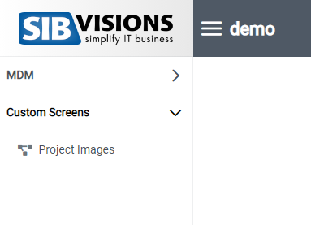

# Custom-Screens

## Overview
Custom-screens are a way to add your own react-coded screens, which aren't avaiable in VisionX, to your application.
Use custom-screens if you want to add screens to your web application, which are react only and don't need to work with the java applications server.

## Implementation
1. In your main class (e.g. App.tsx) call the ```api.addCustomScreen``` function, in a function which will then be passed prefereably as ```onLogin``` to your ```ReactUI``` component, onStartup is also possible, but onLogin is preferred so you can check which user should receive the custom-screen.

### api.addCustomScreen Parameters
Parameter | Type | Description
--- | --- | --- |
id | string | ID of the screen used for routing and gets displayed in the menu.
screen | ReactElement | The component you want to add as custom-screen.

```typescript
  const onLogin = () => {
    if (api.getUser().userName === "admin") {
      api.addCustomScreen("LiveCounter", <CustomCounter />);
    }
    else if (api.getUser().userName === "features") {
      api.addCustomScreen("ProjectImages", <CustomProjectScreen />);
    }
  }
  ```
2. Now your custom-screen is registered, but we still need to add an item to the menu, so we can navigate to the custom-screen. To do that define a function which will be passed as ```onMenu``` to the ```ReactUI``` component. In this function call the ```api.addMenuItem``` function to add a menu-item. ```api.addMenuItem``` receives an object of type ```CustomMenuItem```
  
### CustomMenuItem Properties
Property | Type | Description
--- | --- | --- |
id | string | ID of the screen. The screen has to be already registered by a ```api.addCustomScreen``` call with the same id.
text | string | The text which should be displayed on the menu-item.
menuGroup | string | The menu-group the screen should be added into, if the menu-group isn't already added a new menu-group is created.
icon | string, undefined | An icon which will be displayed in the menu. FontAwesome and PrimeIcon supported

```typescript
  const onMenu = () => {
    if (api.getUser().userName === "admin") {
      api.addMenuItem({
        id: "LiveCounter",
        text: "Live Counter",
        menuGroup: "Custom Screens",
        icon: "pi-plus"
      });
    }
    else if (api.getUser().userName === "features") {
      api.addMenuItem({
        id: "ProjectImages",
        text: "Project Images",
        menuGroup: "Custom Screens",
        icon: "fa-project-diagram"
      });
    }
  }
```
## Example
The custom-screen will be added to the menu-group specified.



Here is an example custom screen I added with components which are not available in VisionX! [Sources can be found here](../../features/CustomProjectScreen.tsx)

